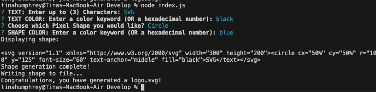
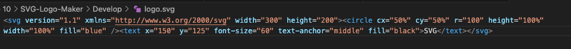

# SVG-Logo-Maker

## Table of Contents
  * [Description](#Description)
  * [Video](#Video)
  * [Installation](#Installation)
  * [Usage](#Usage)
  * [License](#License)
  * [Credit](#Credit)

## Description
Built a Node.js command-line application that takes in user input to generate a logo and save it as an [SVG file]. The application prompts the user to select a color and shape, provide text for the logo, and save the generated SVG to a `.svg` file.

## Video
Click link below to watch the rundown video of the application

👉 https://drive.google.com/file/d/1x1mXHFJoRrQx4MohPAZ_3HkjfsmDG2_p/view

## Installation
Clone project. Run the following line of code in your terminal to install all the needed packages:

npm i

## Usage
Once all the packages have been installed, open terminal and run the following code in command line :

node server.js

## License
This project uses a MIT_License 

## Credit

References https://github.com/elizabetholsavsky/SVG-logo-maker